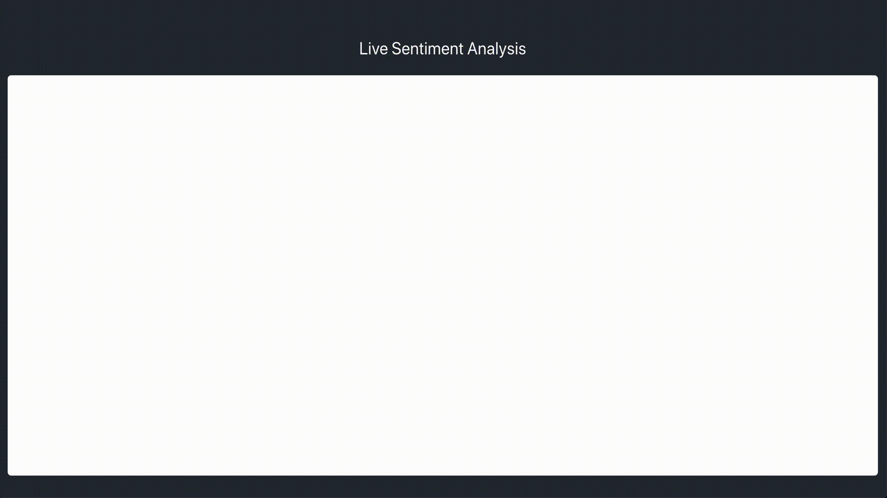

# Live Sentiment Analysis

This is a full-stack toy application that performs sentiment analysis on
textual user input as it is being written. Currently, this is only
designed to run in a dev environment, but with a few minor modifications
it can be deployed with any cloud service provider.

For sake of simplicity, speed, and merit of not having to find a huge
dataset, this application uses the pre-trained rule based VADER model
([paper](https://www.researchgate.net/publication/275828927_VADER_A_Parsimonious_Rule-based_Model_for_Sentiment_Analysis_of_Social_Media_Text))
built into NLTK.

## How to run
1. Clone this repo
2. Navigate to `/api`
3. Create a new virtual enivironment with the dependencies in `/api/requirements.txt`
4. Specify `app.py` as the Flask app to run: `export FLASK_APP=app.py`
5. Run the Flask application: `flask run`
6. In a new terminal (or the same if you ran Flask in the background), navigate to `/ui`
7. Install the React frontend and run the dev server: `npm i; npm start`
8. Go to `localhost:3000` and experiment!